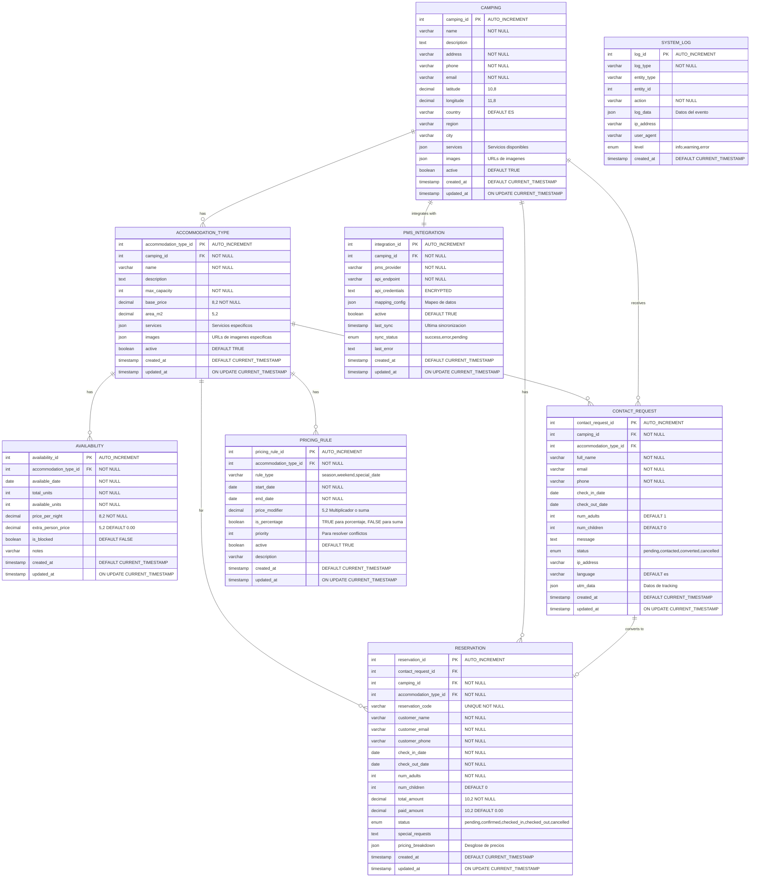
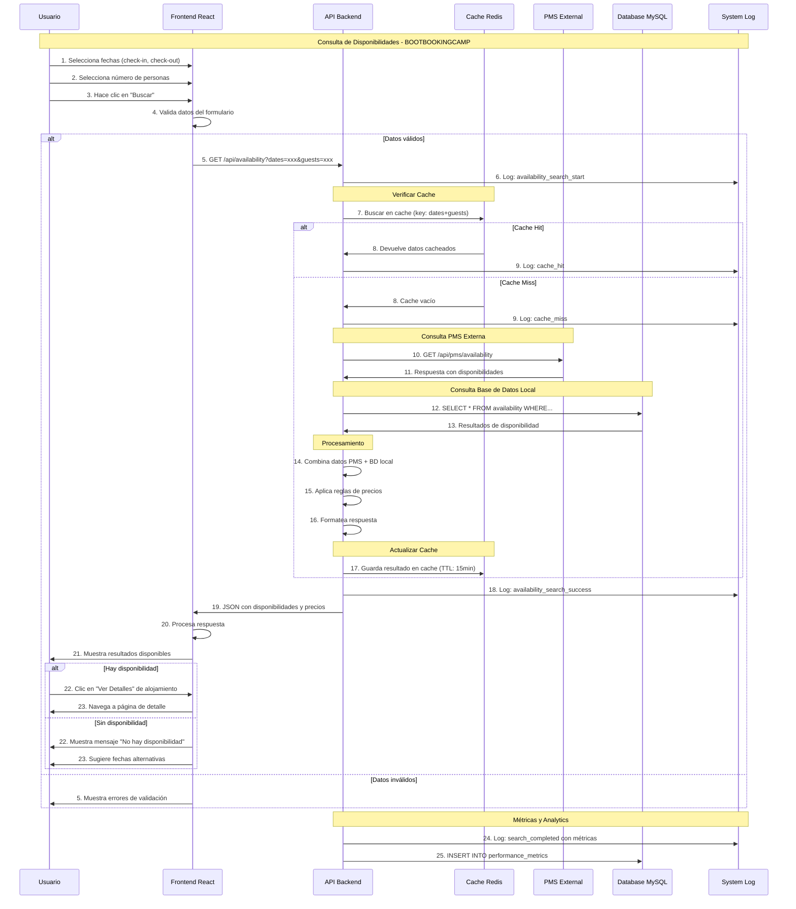
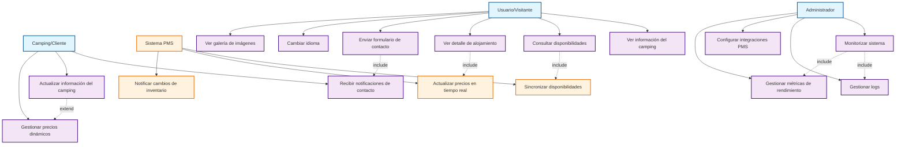
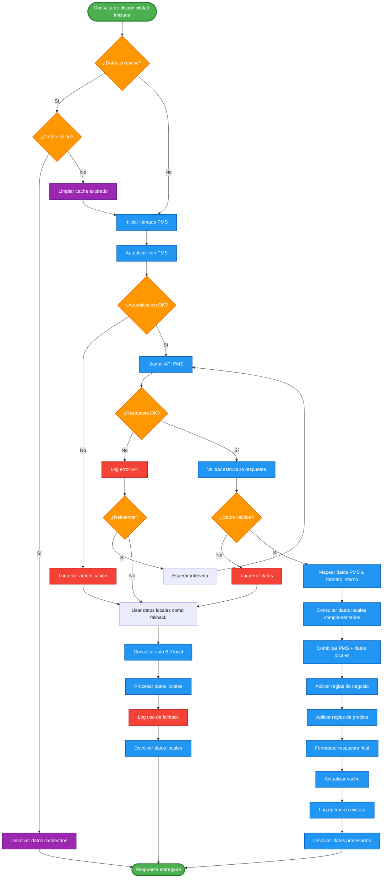
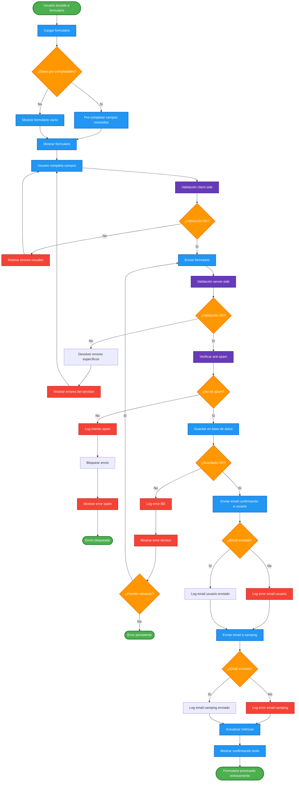

# Modelo de Datos - BOOTBOOKINGCAMP

**Proyecto:** BOOTBOOKINGCAMP - Sistema de reservas para camping (Fase Piloto)  
**Base de datos:** MySQL 8.0  
**Enfoque:** Modelo relacional optimizado para un camping específico con escalabilidad futura

---

## Índice

1. [Diagrama del Modelo de Datos](#1-diagrama-del-modelo-de-datos)
2. [Descripción de Entidades Principales](#2-descripción-de-entidades-principales)
3. [Relaciones y Cardinalidades](#3-relaciones-y-cardinalidades)
4. [Índices y Optimizaciones](#4-índices-y-optimizaciones)
5. [Consideraciones de Escalabilidad](#5-consideraciones-de-escalabilidad)

---

## 1. Diagrama del Modelo de Datos



---

## 2. Descripción de Entidades Principales

### 2.1. CAMPING
**Propósito:** Almacena información básica del camping piloto

| Campo | Tipo | Restricciones | Descripción |
|-------|------|---------------|-------------|
| camping_id | INT | PK, AUTO_INCREMENT | Identificador único del camping |
| name | VARCHAR(100) | NOT NULL | Nombre comercial del camping |
| description | TEXT | - | Descripción completa del camping |
| address | VARCHAR(255) | NOT NULL | Dirección física completa |
| phone | VARCHAR(20) | NOT NULL | Teléfono de contacto principal |
| email | VARCHAR(100) | NOT NULL | Email de contacto principal |
| latitude | DECIMAL(10,8) | - | Coordenada geográfica para el mapa |
| longitude | DECIMAL(11,8) | - | Coordenada geográfica para el mapa |
| country | VARCHAR(10) | DEFAULT 'ES' | Código de país ISO |
| region | VARCHAR(50) | - | Región o provincia |
| city | VARCHAR(50) | - | Ciudad donde se ubica |
| services | JSON | - | Array de servicios disponibles |
| images | JSON | - | Array de URLs de imágenes |
| active | BOOLEAN | DEFAULT TRUE | Estado del camping |
| created_at | TIMESTAMP | DEFAULT CURRENT_TIMESTAMP | Fecha de creación |
| updated_at | TIMESTAMP | ON UPDATE CURRENT_TIMESTAMP | Fecha de última actualización |

**Índices:**
- PRIMARY KEY (camping_id)
- INDEX idx_camping_active (active)
- INDEX idx_camping_location (latitude, longitude)

### 2.2. ACCOMMODATION_TYPE
**Propósito:** Define los tipos de alojamiento disponibles (parcelas, bungalows, etc.)

| Campo | Tipo | Restricciones | Descripción |
|-------|------|---------------|-------------|
| accommodation_type_id | INT | PK, AUTO_INCREMENT | Identificador único del tipo |
| camping_id | INT | FK, NOT NULL | Referencia al camping |
| name | VARCHAR(100) | NOT NULL | Nombre del tipo (ej: "Parcela Estándar") |
| description | TEXT | - | Descripción detallada del alojamiento |
| max_capacity | INT | NOT NULL | Capacidad máxima de personas |
| base_price | DECIMAL(8,2) | NOT NULL | Precio base por noche |
| area_m2 | DECIMAL(5,2) | - | Área en metros cuadrados |
| services | JSON | - | Servicios específicos incluidos |
| images | JSON | - | URLs de imágenes específicas |
| active | BOOLEAN | DEFAULT TRUE | Estado del tipo de alojamiento |
| created_at | TIMESTAMP | DEFAULT CURRENT_TIMESTAMP | Fecha de creación |
| updated_at | TIMESTAMP | ON UPDATE CURRENT_TIMESTAMP | Fecha de actualización |

**Índices:**
- PRIMARY KEY (accommodation_type_id)
- FOREIGN KEY (camping_id) REFERENCES CAMPING(camping_id)
- INDEX idx_accommodation_active (active)
- INDEX idx_accommodation_price (base_price)

### 2.3. AVAILABILITY
**Propósito:** Gestiona la disponibilidad diaria de cada tipo de alojamiento

| Campo | Tipo | Restricciones | Descripción |
|-------|------|---------------|-------------|
| availability_id | INT | PK, AUTO_INCREMENT | Identificador único |
| accommodation_type_id | INT | FK, NOT NULL | Tipo de alojamiento |
| available_date | DATE | NOT NULL | Fecha específica |
| total_units | INT | NOT NULL | Unidades totales disponibles |
| available_units | INT | NOT NULL | Unidades disponibles para reserva |
| price_per_night | DECIMAL(8,2) | NOT NULL | Precio para esta fecha específica |
| extra_person_price | DECIMAL(5,2) | DEFAULT 0.00 | Precio por persona adicional |
| is_blocked | BOOLEAN | DEFAULT FALSE | Fecha bloqueada manualmente |
| notes | VARCHAR(255) | - | Notas administrativas |
| created_at | TIMESTAMP | DEFAULT CURRENT_TIMESTAMP | Fecha de creación |
| updated_at | TIMESTAMP | ON UPDATE CURRENT_TIMESTAMP | Fecha de actualización |

**Índices:**
- PRIMARY KEY (availability_id)
- FOREIGN KEY (accommodation_type_id) REFERENCES ACCOMMODATION_TYPE(accommodation_type_id)
- UNIQUE INDEX idx_availability_unique (accommodation_type_id, available_date)
- INDEX idx_availability_date_range (available_date)
- INDEX idx_availability_units (available_units)

**Restricciones adicionales:**
- CHECK (available_units <= total_units)
- CHECK (available_units >= 0)

### 2.4. CONTACT_REQUEST
**Propósito:** Almacena las solicitudes de contacto/interés de los usuarios

| Campo | Tipo | Restricciones | Descripción |
|-------|------|---------------|-------------|
| contact_request_id | INT | PK, AUTO_INCREMENT | Identificador único |
| camping_id | INT | FK, NOT NULL | Camping de interés |
| accommodation_type_id | INT | FK, NULL | Tipo específico (opcional) |
| full_name | VARCHAR(100) | NOT NULL | Nombre completo del usuario |
| email | VARCHAR(100) | NOT NULL | Email de contacto |
| phone | VARCHAR(20) | NOT NULL | Teléfono de contacto |
| check_in_date | DATE | - | Fecha deseada de entrada |
| check_out_date | DATE | - | Fecha deseada de salida |
| num_adults | INT | DEFAULT 1 | Número de adultos |
| num_children | INT | DEFAULT 0 | Número de niños |
| message | TEXT | - | Mensaje adicional del usuario |
| status | ENUM | DEFAULT 'pending' | Estado: pending, contacted, converted, cancelled |
| ip_address | VARCHAR(45) | - | IP del usuario (para analytics) |
| language | VARCHAR(10) | DEFAULT 'es' | Idioma preferido |
| utm_data | JSON | - | Datos de tracking/marketing |
| created_at | TIMESTAMP | DEFAULT CURRENT_TIMESTAMP | Fecha de creación |
| updated_at | TIMESTAMP | ON UPDATE CURRENT_TIMESTAMP | Fecha de actualización |

**Índices:**
- PRIMARY KEY (contact_request_id)
- FOREIGN KEY (camping_id) REFERENCES CAMPING(camping_id)
- FOREIGN KEY (accommodation_type_id) REFERENCES ACCOMMODATION_TYPE(accommodation_type_id)
- INDEX idx_contact_status (status)
- INDEX idx_contact_dates (check_in_date, check_out_date)
- INDEX idx_contact_email (email)

### 2.5. RESERVATION
**Propósito:** Gestiona las reservas confirmadas (funcionalidad futura)

| Campo | Tipo | Restricciones | Descripción |
|-------|------|---------------|-------------|
| reservation_id | INT | PK, AUTO_INCREMENT | Identificador único |
| contact_request_id | INT | FK, NULL | Solicitud que originó la reserva |
| camping_id | INT | FK, NOT NULL | Camping reservado |
| accommodation_type_id | INT | FK, NOT NULL | Tipo de alojamiento |
| reservation_code | VARCHAR(20) | UNIQUE, NOT NULL | Código único de reserva |
| customer_name | VARCHAR(100) | NOT NULL | Nombre del cliente |
| customer_email | VARCHAR(100) | NOT NULL | Email del cliente |
| customer_phone | VARCHAR(20) | NOT NULL | Teléfono del cliente |
| check_in_date | DATE | NOT NULL | Fecha de entrada |
| check_out_date | DATE | NOT NULL | Fecha de salida |
| num_adults | INT | NOT NULL | Número de adultos |
| num_children | INT | DEFAULT 0 | Número de niños |
| total_amount | DECIMAL(10,2) | NOT NULL | Importe total |
| paid_amount | DECIMAL(10,2) | DEFAULT 0.00 | Cantidad pagada |
| status | ENUM | DEFAULT 'pending' | Estado de la reserva |
| special_requests | TEXT | - | Solicitudes especiales |
| pricing_breakdown | JSON | - | Desglose detallado de precios |
| created_at | TIMESTAMP | DEFAULT CURRENT_TIMESTAMP | Fecha de creación |
| updated_at | TIMESTAMP | ON UPDATE CURRENT_TIMESTAMP | Fecha de actualización |

**Índices:**
- PRIMARY KEY (reservation_id)
- UNIQUE INDEX idx_reservation_code (reservation_code)
- FOREIGN KEY (camping_id) REFERENCES CAMPING(camping_id)
- FOREIGN KEY (accommodation_type_id) REFERENCES ACCOMMODATION_TYPE(accommodation_type_id)
- FOREIGN KEY (contact_request_id) REFERENCES CONTACT_REQUEST(contact_request_id)
- INDEX idx_reservation_dates (check_in_date, check_out_date)
- INDEX idx_reservation_status (status)
- INDEX idx_reservation_customer (customer_email)

### 2.6. PMS_INTEGRATION
**Propósito:** Configuración para integración con sistemas PMS externos

| Campo | Tipo | Restricciones | Descripción |
|-------|------|---------------|-------------|
| integration_id | INT | PK, AUTO_INCREMENT | Identificador único |
| camping_id | INT | FK, NOT NULL | Camping asociado |
| pms_provider | VARCHAR(50) | NOT NULL | Proveedor del PMS |
| api_endpoint | VARCHAR(255) | NOT NULL | URL del endpoint API |
| api_credentials | TEXT | - | Credenciales encriptadas |
| mapping_config | JSON | - | Configuración de mapeo |
| active | BOOLEAN | DEFAULT TRUE | Estado de la integración |
| last_sync | TIMESTAMP | - | Última sincronización exitosa |
| sync_status | ENUM | DEFAULT 'pending' | Estado de sincronización |
| last_error | TEXT | - | Último error registrado |
| created_at | TIMESTAMP | DEFAULT CURRENT_TIMESTAMP | Fecha de creación |
| updated_at | TIMESTAMP | ON UPDATE CURRENT_TIMESTAMP | Fecha de actualización |

**Índices:**
- PRIMARY KEY (integration_id)
- FOREIGN KEY (camping_id) REFERENCES CAMPING(camping_id)
- INDEX idx_integration_active (active)
- INDEX idx_integration_sync (sync_status, last_sync)

### 2.7. PRICING_RULE
**Propósito:** Reglas de precios dinámicos por temporada/eventos

| Campo | Tipo | Restricciones | Descripción |
|-------|------|---------------|-------------|
| pricing_rule_id | INT | PK, AUTO_INCREMENT | Identificador único |
| accommodation_type_id | INT | FK, NOT NULL | Tipo de alojamiento |
| rule_type | VARCHAR(50) | NOT NULL | Tipo: season, weekend, special_date |
| start_date | DATE | NOT NULL | Fecha inicio aplicación |
| end_date | DATE | NOT NULL | Fecha fin aplicación |
| price_modifier | DECIMAL(5,2) | NOT NULL | Modificador de precio |
| is_percentage | BOOLEAN | NOT NULL | TRUE: %, FALSE: suma fija |
| priority | INT | NOT NULL | Prioridad para resolver conflictos |
| active | BOOLEAN | DEFAULT TRUE | Estado de la regla |
| description | VARCHAR(255) | - | Descripción de la regla |
| created_at | TIMESTAMP | DEFAULT CURRENT_TIMESTAMP | Fecha de creación |
| updated_at | TIMESTAMP | ON UPDATE CURRENT_TIMESTAMP | Fecha de actualización |

**Índices:**
- PRIMARY KEY (pricing_rule_id)
- FOREIGN KEY (accommodation_type_id) REFERENCES ACCOMMODATION_TYPE(accommodation_type_id)
- INDEX idx_pricing_dates (start_date, end_date)
- INDEX idx_pricing_priority (priority)

### 2.8. SYSTEM_LOG
**Propósito:** Registro de eventos del sistema para auditoría y debugging

| Campo | Tipo | Restricciones | Descripción |
|-------|------|---------------|-------------|
| log_id | INT | PK, AUTO_INCREMENT | Identificador único |
| log_type | VARCHAR(50) | NOT NULL | Tipo de log: api, user_action, error |
| entity_type | VARCHAR(100) | - | Tipo de entidad afectada |
| entity_id | INT | - | ID de la entidad afectada |
| action | VARCHAR(50) | NOT NULL | Acción realizada |
| log_data | JSON | - | Datos adicionales del evento |
| ip_address | VARCHAR(45) | - | IP del origen |
| user_agent | VARCHAR(255) | - | User agent del navegador |
| level | ENUM | DEFAULT 'info' | Nivel: info, warning, error |
| created_at | TIMESTAMP | DEFAULT CURRENT_TIMESTAMP | Fecha del evento |

**Índices:**
- PRIMARY KEY (log_id)
- INDEX idx_log_type_level (log_type, level)
- INDEX idx_log_created (created_at)
- INDEX idx_log_entity (entity_type, entity_id)

---

## 3. Relaciones y Cardinalidades

### 3.1. Relaciones Principales

**CAMPING → ACCOMMODATION_TYPE**
- Cardinalidad: 1:N
- Un camping tiene múltiples tipos de alojamiento
- FK: accommodation_type.camping_id → camping.camping_id

**ACCOMMODATION_TYPE → AVAILABILITY**
- Cardinalidad: 1:N
- Cada tipo de alojamiento tiene disponibilidad por fecha
- FK: availability.accommodation_type_id → accommodation_type.accommodation_type_id

**CAMPING → CONTACT_REQUEST**
- Cardinalidad: 1:N
- Un camping recibe múltiples solicitudes de contacto
- FK: contact_request.camping_id → camping.camping_id

**ACCOMMODATION_TYPE → CONTACT_REQUEST**
- Cardinalidad: 1:N (opcional)
- Un tipo específico puede ser solicitado
- FK: contact_request.accommodation_type_id → accommodation_type.accommodation_type_id

**CONTACT_REQUEST → RESERVATION**
- Cardinalidad: 1:0..1
- Una solicitud puede convertirse en reserva
- FK: reservation.contact_request_id → contact_request.contact_request_id

**CAMPING → PMS_INTEGRATION**
- Cardinalidad: 1:1
- Cada camping tiene una configuración PMS
- FK: pms_integration.camping_id → camping.camping_id

### 3.2. Restricciones de Integridad

```sql
-- Restricciones de fechas
ALTER TABLE contact_request 
ADD CONSTRAINT chk_contact_dates 
CHECK (check_out_date IS NULL OR check_in_date IS NULL OR check_out_date > check_in_date);

ALTER TABLE reservation 
ADD CONSTRAINT chk_reservation_dates 
CHECK (check_out_date > check_in_date);

ALTER TABLE pricing_rule 
ADD CONSTRAINT chk_pricing_dates 
CHECK (end_date >= start_date);

-- Restricciones de capacidad
ALTER TABLE contact_request 
ADD CONSTRAINT chk_contact_capacity 
CHECK (num_adults > 0 AND num_children >= 0);

ALTER TABLE reservation 
ADD CONSTRAINT chk_reservation_capacity 
CHECK (num_adults > 0 AND num_children >= 0);

-- Restricciones de disponibilidad
ALTER TABLE availability 
ADD CONSTRAINT chk_availability_units 
CHECK (available_units >= 0 AND available_units <= total_units);

-- Restricciones de precios
ALTER TABLE accommodation_type 
ADD CONSTRAINT chk_accommodation_price 
CHECK (base_price > 0);

ALTER TABLE availability 
ADD CONSTRAINT chk_availability_price 
CHECK (price_per_night > 0);
```

---

## 4. Índices y Optimizaciones

### 4.1. Índices de Rendimiento

```sql
-- Índices para consultas de disponibilidad (uso frecuente)
CREATE INDEX idx_availability_search ON availability 
(accommodation_type_id, available_date, available_units);

-- Índice compuesto para búsquedas por rango de fechas
CREATE INDEX idx_availability_date_range ON availability 
(available_date, accommodation_type_id, available_units);

-- Índice para consultas de contacto por estado
CREATE INDEX idx_contact_status_date ON contact_request 
(status, created_at);

-- Índice para reporting y analytics
CREATE INDEX idx_reservation_reporting ON reservation 
(status, check_in_date, accommodation_type_id);

-- Índice para logs (particionado por fecha)
CREATE INDEX idx_log_cleanup ON system_log 
(created_at, level);
```

### 4.2. Particionamiento (Preparación Futura)

```sql
-- Particionamiento de availability por año
-- (Se implementará cuando el volumen de datos lo justifique)
ALTER TABLE availability 
PARTITION BY RANGE (YEAR(available_date)) (
    PARTITION p2024 VALUES LESS THAN (2025),
    PARTITION p2025 VALUES LESS THAN (2026),
    PARTITION p2026 VALUES LESS THAN (2027),
    PARTITION p_future VALUES LESS THAN MAXVALUE
);

-- Particionamiento de system_log por mes
ALTER TABLE system_log 
PARTITION BY RANGE (YEAR(created_at) * 100 + MONTH(created_at)) (
    PARTITION p202410 VALUES LESS THAN (202411),
    PARTITION p202411 VALUES LESS THAN (202412),
    PARTITION p202412 VALUES LESS THAN (202501),
    PARTITION p_future VALUES LESS THAN MAXVALUE
);
```

---

## 5. Consideraciones de Escalabilidad

### 5.1. Preparación para Multi-Camping

**Estructura Actual:** Diseñada con `camping_id` en todas las entidades relevantes
**Ventajas:** Fácil migración a multi-tenant
**Modificaciones Futuras Mínimas:** 
- Añadir filtros por `camping_id` en consultas
- Implementar particionamiento por camping
- Añadir índices compuestos con `camping_id`

### 5.2. Optimizaciones de Rendimiento

**Cache Strategy:**
```sql
-- Tabla de cache para disponibilidades frecuentes
CREATE TABLE availability_cache (
    cache_key VARCHAR(255) PRIMARY KEY,
    cache_data JSON NOT NULL,
    expires_at TIMESTAMP NOT NULL,
    created_at TIMESTAMP DEFAULT CURRENT_TIMESTAMP
);

CREATE INDEX idx_cache_expiry ON availability_cache (expires_at);
```

**Vistas Materializadas:**
```sql
-- Vista para consultas rápidas de disponibilidad
CREATE VIEW v_accommodation_availability AS
SELECT 
    at.accommodation_type_id,
    at.camping_id,
    at.name,
    at.base_price,
    av.available_date,
    av.available_units,
    av.price_per_night
FROM accommodation_type at
JOIN availability av ON at.accommodation_type_id = av.accommodation_type_id
WHERE at.active = TRUE 
AND av.available_units > 0 
AND av.is_blocked = FALSE;
```

### 5.3. Estrategia de Backup y Mantenimiento

**Retention Policies:**
```sql
-- Procedimiento para limpiar logs antiguos
DELIMITER $$
CREATE PROCEDURE CleanupOldLogs()
BEGIN
    DELETE FROM system_log 
    WHERE created_at < DATE_SUB(NOW(), INTERVAL 90 DAY) 
    AND level = 'info';
    
    DELETE FROM system_log 
    WHERE created_at < DATE_SUB(NOW(), INTERVAL 365 DAY);
END$$
DELIMITER ;

-- Evento programado para ejecutar limpieza
CREATE EVENT IF NOT EXISTS cleanup_logs
ON SCHEDULE EVERY 1 WEEK
DO CALL CleanupOldLogs();
```

### 5.4. Monitorización y Métricas

**Tablas de Métricas:**
```sql
-- Tabla para métricas de rendimiento
CREATE TABLE performance_metrics (
    metric_id INT AUTO_INCREMENT PRIMARY KEY,
    metric_name VARCHAR(100) NOT NULL,
    metric_value DECIMAL(10,4) NOT NULL,
    metric_date DATE NOT NULL,
    created_at TIMESTAMP DEFAULT CURRENT_TIMESTAMP,
    UNIQUE KEY uk_metric_date (metric_name, metric_date)
);

-- Métricas clave a trackear:
-- - availability_search_time
-- - contact_conversion_rate  
-- - pms_sync_success_rate
-- - daily_active_searches
```

---

## Conclusiones

Este modelo de datos está diseñado para:

1. **Fase Piloto Actual:** Soporte completo para un camping específico
2. **Escalabilidad:** Preparado para expansión multi-camping
3. **Rendimiento:** Índices optimizados para consultas frecuentes
4. **Integridad:** Restricciones que garantizan consistencia de datos
5. **Auditoría:** Sistema completo de logging y tracking
6. **Flexibilidad:** Campos JSON para datos semi-estructurados
7. **Mantenimiento:** Estrategias de limpieza y optimización automatizadas

El diseño balances la simplicidad necesaria para el MVP con la flexibilidad requerida para el crecimiento futuro del proyecto BOOTBOOKINGCAMP.

---

## Ejemplo: Diagrama de Secuencia

### Flujo de Consulta de Disponibilidades

Este diagrama muestra la secuencia completa cuando un usuario consulta disponibilidades en BOOTBOOKINGCAMP:



### Descripción del Flujo:

**1. Interacción Usuario (Pasos 1-3):**
- Usuario selecciona fechas de entrada y salida
- Especifica número de personas
- Inicia búsqueda

**2. Validación Frontend (Paso 4):**
- Validación client-side de fechas y datos
- Verificación de formato y lógica

**3. Consulta API (Pasos 5-6):**
- Llamada REST al backend
- Logging del inicio de búsqueda

**4. Estrategia de Cache (Pasos 7-9):**
- Verificación en Redis Cache
- Cache hit: respuesta inmediata
- Cache miss: proceder con consulta completa

**5. Integración PMS (Pasos 10-11):**
- Consulta al sistema PMS externo del camping
- Obtención de disponibilidades en tiempo real

**6. Consulta Base de Datos (Pasos 12-13):**
- Query a tabla `availability` local
- Obtención de datos complementarios

**7. Procesamiento Backend (Pasos 14-16):**
- Combinación de datos PMS + BD local
- Aplicación de reglas de precios dinámicos
- Formateo de respuesta para frontend

**8. Actualización Cache (Paso 17):**
- Almacenamiento en Redis con TTL de 15 minutos
- Optimización para futuras consultas similares

**9. Respuesta y Visualización (Pasos 18-21):**
- Logging de éxito
- Envío de JSON con resultados
- Renderizado en interfaz de usuario

**10. Flujos Alternativos (Pasos 22-23):**
- Con disponibilidad: navegación a detalles
- Sin disponibilidad: mensaje y sugerencias

**11. Analytics (Pasos 24-25):**
- Registro de métricas de rendimiento
- Almacenamiento para reporting

### Componentes Involucrados:

- **Frontend React:** Interfaz de usuario y validaciones
- **API Backend:** Lógica de negocio y orquestación
- **Cache Redis:** Optimización de rendimiento
- **PMS External:** Sistema del camping piloto
- **Database MySQL:** Almacenamiento persistente
- **System Log:** Auditoría y debugging

### Optimizaciones Implementadas:

- ✅ **Cache Strategy:** TTL de 15 minutos para consultas frecuentes
- ✅ **Logging Completo:** Trazabilidad de todas las operaciones
- ✅ **Fallback Graceful:** Manejo de errores en PMS externo
- ✅ **Performance Metrics:** Seguimiento de tiempos de respuesta
- ✅ **Validación Dual:** Client-side y server-side

Este diagrama representa el flujo crítico de la **HU003: Consultar disponibilidad por fechas**, mostrando la integración completa entre todos los componentes del sistema BOOTBOOKINGCAMP.

### Prompt ##

genera los diagrams de flujos y los casos de uso

---

## Diagramas de Casos de Uso

### Diagrama General de Casos de Uso - BOOTBOOKINGCAMP



### Casos de Uso Detallados

#### UC001: Ver información del camping
**Actor Principal:** Usuario/Visitante  
**Descripción:** El usuario accede a la información completa del camping  
**Precondiciones:** Acceso a la plataforma web  
**Flujo Principal:**
1. Usuario accede a la página principal
2. Sistema muestra información del camping (nombre, descripción, ubicación)
3. Sistema presenta servicios disponibles con iconografía
4. Sistema muestra galería de imágenes
5. Sistema integra mapa de ubicación
6. Usuario puede cambiar idioma (ES, CA, EN, FR)

**Postcondiciones:** Usuario visualiza información completa del camping

#### UC002: Consultar disponibilidades  
**Actor Principal:** Usuario/Visitante  
**Actores Secundarios:** Sistema PMS  
**Descripción:** El usuario consulta disponibilidad para fechas específicas  
**Precondiciones:** Información del camping cargada  
**Flujo Principal:**
1. Usuario selecciona fechas de entrada y salida
2. Usuario especifica número de personas (adultos/niños)
3. Usuario selecciona tipo de alojamiento (opcional)
4. Sistema valida datos ingresados
5. Sistema consulta cache Redis
6. Si no hay cache, sistema consulta PMS externo
7. Sistema combina datos PMS con base de datos local
8. Sistema aplica reglas de precios dinámicos
9. Sistema muestra resultados con disponibilidad y precios
10. Usuario puede ver detalles de cada tipo de alojamiento

**Flujos Alternativos:**
- **4a.** Datos inválidos: Sistema muestra errores de validación
- **9a.** Sin disponibilidad: Sistema muestra mensaje y sugiere fechas alternativas

**Postcondiciones:** Usuario visualiza disponibilidades para las fechas solicitadas

#### UC003: Ver detalle de alojamiento
**Actor Principal:** Usuario/Visitante  
**Descripción:** El usuario accede a información específica de un tipo de alojamiento  
**Precondiciones:** Consulta de disponibilidades realizada  
**Flujo Principal:**
1. Usuario hace clic en "Ver Detalles" desde resultados de búsqueda
2. Sistema navega a página de detalle
3. Sistema muestra información específica del alojamiento
4. Sistema presenta galería específica del tipo de alojamiento
5. Sistema muestra servicios incluidos detallados
6. Sistema presenta desglose de precios
7. Usuario puede refinar fechas desde esta página
8. Sistema recalcula precios automáticamente
9. Usuario puede proceder a contactar o reservar

**Postcondiciones:** Usuario visualiza información detallada del alojamiento seleccionado

#### UC004: Enviar formulario de contacto
**Actor Principal:** Usuario/Visitante  
**Actores Secundarios:** Camping/Cliente  
**Descripción:** El usuario envía solicitud de contacto/reserva  
**Precondiciones:** Usuario interesado en realizar reserva  
**Flujo Principal:**
1. Usuario accede al formulario de contacto
2. Sistema pre-completa datos si viene desde detalle de alojamiento
3. Usuario completa información personal requerida
4. Usuario especifica fechas y número de personas
5. Usuario añade mensaje personalizado (opcional)
6. Sistema valida datos del formulario
7. Sistema almacena solicitud en base de datos
8. Sistema envía email de confirmación al usuario
9. Sistema notifica automáticamente al camping
10. Sistema muestra confirmación de envío exitoso

**Flujos Alternativos:**
- **6a.** Validación fallida: Sistema muestra errores específicos
- **8a.** Error en envío: Sistema registra error y permite reintento

**Postcondiciones:** Solicitud registrada y notificaciones enviadas

---

## Diagramas de Flujo

### Flujo Principal del Usuario

```mermaid
flowchart TD
    Start([Usuario accede a BOOTBOOKINGCAMP]) --> ViewCamping[Ver información del camping]
    
    ViewCamping --> Decision1{¿Interesado en reservar?}
    Decision1 -->|No| End1([Abandona sitio])
    Decision1 -->|Sí| SearchForm[Completar formulario de búsqueda]
    
    SearchForm --> ValidateForm{¿Datos válidos?}
    ValidateForm -->|No| ShowErrors[Mostrar errores de validación]
    ShowErrors --> SearchForm
    
    ValidateForm -->|Sí| SearchAPI[Consultar disponibilidades API]
    SearchAPI --> CheckCache{¿Existe en cache?}
    
    CheckCache -->|Sí| ReturnCached[Devolver datos cacheados]
    CheckCache -->|No| QueryPMS[Consultar PMS externo]
    
    QueryPMS --> QueryDB[Consultar base de datos local]
    QueryDB --> ProcessData[Combinar y procesar datos]
    ProcessData --> ApplyPricing[Aplicar reglas de precios]
    ApplyPricing --> UpdateCache[Actualizar cache]
    UpdateCache --> ReturnResults[Devolver resultados]
    
    ReturnCached --> ShowResults[Mostrar disponibilidades]
    ReturnResults --> ShowResults
    
    ShowResults --> Decision2{¿Hay disponibilidad?}
    Decision2 -->|No| ShowNoAvailability[Mostrar mensaje sin disponibilidad]
    ShowNoAvailability --> SuggestAlternatives[Sugerir fechas alternativas]
    SuggestAlternatives --> Decision3{¿Probar otras fechas?}
    Decision3 -->|Sí| SearchForm
    Decision3 -->|No| End2([Usuario abandona])
    
    Decision2 -->|Sí| ShowAvailable[Mostrar alojamientos disponibles]
    ShowAvailable --> Decision4{¿Ver detalles?}
    
    Decision4 -->|No| Decision5{¿Contactar directamente?}
    Decision4 -->|Sí| ViewDetails[Ver página de detalle]
    
    ViewDetails --> RefineSearch{¿Refinar búsqueda?}
    RefineSearch -->|Sí| UpdateDates[Actualizar fechas/personas]
    UpdateDates --> RecalculatePrice[Recalcular precios]
    RecalculatePrice --> ViewDetails
    
    RefineSearch -->|No| Decision6{¿Proceder a contactar?}
    Decision6 -->|No| Back[Volver a resultados]
    Back --> ShowAvailable
    
    Decision5 -->|Sí| ContactForm[Ir a formulario de contacto]
    Decision6 -->|Sí| ContactForm
    
    ContactForm --> FillForm[Completar formulario]
    FillForm --> ValidateContact{¿Datos válidos?}
    ValidateContact -->|No| ShowContactErrors[Mostrar errores]
    ShowContactErrors --> FillForm
    
    ValidateContact -->|Sí| SubmitForm[Enviar formulario]
    SubmitForm --> SaveDB[Guardar en base de datos]
    SaveDB --> SendEmails[Enviar emails]
    SendEmails --> ShowSuccess[Mostrar confirmación]
    ShowSuccess --> End3([Proceso completado])

    %% Estilos
    classDef startEnd fill:#4caf50,stroke:#2e7d32,stroke-width:3px,color:white
    classDef process fill:#2196f3,stroke:#1565c0,stroke-width:2px,color:white
    classDef decision fill:#ff9800,stroke:#ef6c00,stroke-width:2px,color:white
    classDef error fill:#f44336,stroke:#c62828,stroke-width:2px,color:white
    
    class Start,End1,End2,End3 startEnd
    class ViewCamping,SearchForm,SearchAPI,QueryPMS,QueryDB,ProcessData,ApplyPricing,UpdateCache,ReturnResults,ReturnCached,ShowResults,ShowAvailable,ViewDetails,UpdateDates,RecalculatePrice,ContactForm,FillForm,SubmitForm,SaveDB,SendEmails,ShowSuccess process
    class Decision1,Decision2,Decision3,Decision4,Decision5,Decision6,ValidateForm,CheckCache,RefineSearch,ValidateContact decision
    class ShowErrors,ShowNoAvailability,ShowContactErrors error
```



### Flujo de Integración PMS



### Flujo de Gestión de Formularios



Estos diagramas proporcionan una visión completa de:

1. **Casos de Uso:** Interacciones principales entre actores y sistema
2. **Flujo Principal:** Journey completo del usuario desde llegada hasta conversión
3. **Integración PMS:** Manejo robusto de sistemas externos con fallbacks
4. **Gestión de Formularios:** Proceso completo con validaciones y notificaciones

Todos están diseñados específicamente para BOOTBOOKINGCAMP y cubren las 3 historias de usuario críticas del proyecto.


