# Diagramas BOOTBOOKINGCAMP

**Herramienta Utilizada:** Diagramming AI  
**Proyecto:** BOOTBOOKINGCAMP - Sistema de reservas para camping (Fase Piloto)  
**Fecha:** Octubre 2025

---

## Información de Creación

Todos los diagramas de este proyecto han sido creados utilizando **Diagramming AI** (https://diagramming.ai/), una herramienta de inteligencia artificial especializada en la generación automática de diagramas técnicos y de arquitectura.

### ¿Por qué Diagramming AI?

**Ventajas utilizadas:**
- ✅ **Generación automática** a partir de código Mermaid
- ✅ **Compatibilidad perfecta** con sintaxis Mermaid ERD
- ✅ **Renderizado profesional** de diagramas complejos
- ✅ **Exportación de alta calidad** en múltiples formatos
- ✅ **Optimización automática** del layout y distribución
- ✅ **Soporte completo** para relaciones de bases de datos

### Proceso de Creación

1. **Código Mermaid:** Se desarrolló el código del modelo de datos en formato Mermaid ERD
2. **Importación:** Se importó el código corregido en Diagramming AI
3. **Generación:** La IA procesó automáticamente el código y generó el diagrama visual
4. **Optimización:** Se aplicaron ajustes automáticos de layout y estética
5. **Exportación:** Se exportó en formato PNG de alta resolución

### Diagramas Incluidos

**📊 Diagrama del Modelo de Datos:**
- **Archivo:** `diagram_modelo_de_datos.png`
- **Descripción:** Diagrama entidad-relación completo del sistema BOOTBOOKINGCAMP
- **Entidades:** 8 tablas principales con todas sus relaciones
- **Características:** Claves primarias, foráneas, tipos de datos y cardinalidades

---

## Código Mermaid Utilizado

El siguiente código Mermaid fue procesado por Diagramming AI para generar el diagrama visual:

```mermaid
erDiagram
    CAMPING {
        int camping_id PK "AUTO_INCREMENT"
        varchar name "NOT NULL"
        text description
        varchar address "NOT NULL"
        varchar phone "NOT NULL"
        varchar email "NOT NULL"
        decimal latitude "10,8"
        decimal longitude "11,8"
        varchar country "DEFAULT ES"
        varchar region
        varchar city
        json services "Servicios disponibles"
        json images "URLs de imagenes"
        boolean active "DEFAULT TRUE"
        timestamp created_at "DEFAULT CURRENT_TIMESTAMP"
        timestamp updated_at "ON UPDATE CURRENT_TIMESTAMP"
    }

    ACCOMMODATION_TYPE {
        int accommodation_type_id PK "AUTO_INCREMENT"
        int camping_id FK "NOT NULL"
        varchar name "NOT NULL"
        text description
        int max_capacity "NOT NULL"
        decimal base_price "8,2 NOT NULL"
        decimal area_m2 "5,2"
        json services "Servicios especificos"
        json images "URLs de imagenes especificas"
        boolean active "DEFAULT TRUE"
        timestamp created_at "DEFAULT CURRENT_TIMESTAMP"
        timestamp updated_at "ON UPDATE CURRENT_TIMESTAMP"
    }

    AVAILABILITY {
        int availability_id PK "AUTO_INCREMENT"
        int accommodation_type_id FK "NOT NULL"
        date available_date "NOT NULL"
        int total_units "NOT NULL"
        int available_units "NOT NULL"
        decimal price_per_night "8,2 NOT NULL"
        decimal extra_person_price "5,2 DEFAULT 0.00"
        boolean is_blocked "DEFAULT FALSE"
        varchar notes
        timestamp created_at "DEFAULT CURRENT_TIMESTAMP"
        timestamp updated_at "ON UPDATE CURRENT_TIMESTAMP"
    }

    CONTACT_REQUEST {
        int contact_request_id PK "AUTO_INCREMENT"
        int camping_id FK "NOT NULL"
        int accommodation_type_id FK
        varchar full_name "NOT NULL"
        varchar email "NOT NULL"
        varchar phone "NOT NULL"
        date check_in_date
        date check_out_date
        int num_adults "DEFAULT 1"
        int num_children "DEFAULT 0"
        text message
        enum status "pending,contacted,converted,cancelled"
        varchar ip_address
        varchar language "DEFAULT es"
        json utm_data "Datos de tracking"
        timestamp created_at "DEFAULT CURRENT_TIMESTAMP"
        timestamp updated_at "ON UPDATE CURRENT_TIMESTAMP"
    }

    RESERVATION {
        int reservation_id PK "AUTO_INCREMENT"
        int contact_request_id FK
        int camping_id FK "NOT NULL"
        int accommodation_type_id FK "NOT NULL"
        varchar reservation_code "UNIQUE NOT NULL"
        varchar customer_name "NOT NULL"
        varchar customer_email "NOT NULL"
        varchar customer_phone "NOT NULL"
        date check_in_date "NOT NULL"
        date check_out_date "NOT NULL"
        int num_adults "NOT NULL"
        int num_children "DEFAULT 0"
        decimal total_amount "10,2 NOT NULL"
        decimal paid_amount "10,2 DEFAULT 0.00"
        enum status "pending,confirmed,checked_in,checked_out,cancelled"
        text special_requests
        json pricing_breakdown "Desglose de precios"
        timestamp created_at "DEFAULT CURRENT_TIMESTAMP"
        timestamp updated_at "ON UPDATE CURRENT_TIMESTAMP"
    }

    PMS_INTEGRATION {
        int integration_id PK "AUTO_INCREMENT"
        int camping_id FK "NOT NULL"
        varchar pms_provider "NOT NULL"
        varchar api_endpoint "NOT NULL"
        text api_credentials "ENCRYPTED"
        json mapping_config "Mapeo de datos"
        boolean active "DEFAULT TRUE"
        timestamp last_sync "Ultima sincronizacion"
        enum sync_status "success,error,pending"
        text last_error
        timestamp created_at "DEFAULT CURRENT_TIMESTAMP"
        timestamp updated_at "ON UPDATE CURRENT_TIMESTAMP"
    }

    SYSTEM_LOG {
        int log_id PK "AUTO_INCREMENT"
        varchar log_type "NOT NULL"
        varchar entity_type
        int entity_id
        varchar action "NOT NULL"
        json log_data "Datos del evento"
        varchar ip_address
        varchar user_agent
        enum level "info,warning,error"
        timestamp created_at "DEFAULT CURRENT_TIMESTAMP"
    }

    PRICING_RULE {
        int pricing_rule_id PK "AUTO_INCREMENT"
        int accommodation_type_id FK "NOT NULL"
        varchar rule_type "season,weekend,special_date"
        date start_date "NOT NULL"
        date end_date "NOT NULL"
        decimal price_modifier "5,2 Multiplicador o suma"
        boolean is_percentage "TRUE para porcentaje, FALSE para suma"
        int priority "Para resolver conflictos"
        boolean active "DEFAULT TRUE"
        varchar description
        timestamp created_at "DEFAULT CURRENT_TIMESTAMP"
        timestamp updated_at "ON UPDATE CURRENT_TIMESTAMP"
    }

    %% Relaciones
    CAMPING ||--o{ ACCOMMODATION_TYPE : "has"
    ACCOMMODATION_TYPE ||--o{ AVAILABILITY : "has"
    CAMPING ||--o{ CONTACT_REQUEST : "receives"
    ACCOMMODATION_TYPE ||--o{ CONTACT_REQUEST : "for"
    CONTACT_REQUEST ||--o| RESERVATION : "converts to"
    CAMPING ||--o{ RESERVATION : "has"
    ACCOMMODATION_TYPE ||--o{ RESERVATION : "for"
    CAMPING ||--|| PMS_INTEGRATION : "integrates with"
    ACCOMMODATION_TYPE ||--o{ PRICING_RULE : "has"
```

---

## Resultado Final

El diagrama generado por Diagramming AI proporciona una representación visual clara y profesional del modelo de datos de BOOTBOOKINGCAMP, mostrando:

- **8 entidades principales** perfectamente organizadas
- **Relaciones claras** con cardinalidades específicas
- **Tipos de datos detallados** para cada campo
- **Claves primarias y foráneas** claramente identificadas
- **Layout optimizado** para máxima legibilidad

Esta herramienta ha permitido crear documentación visual de alta calidad que facilita la comprensión del diseño de la base de datos tanto para desarrolladores como para stakeholders del proyecto.